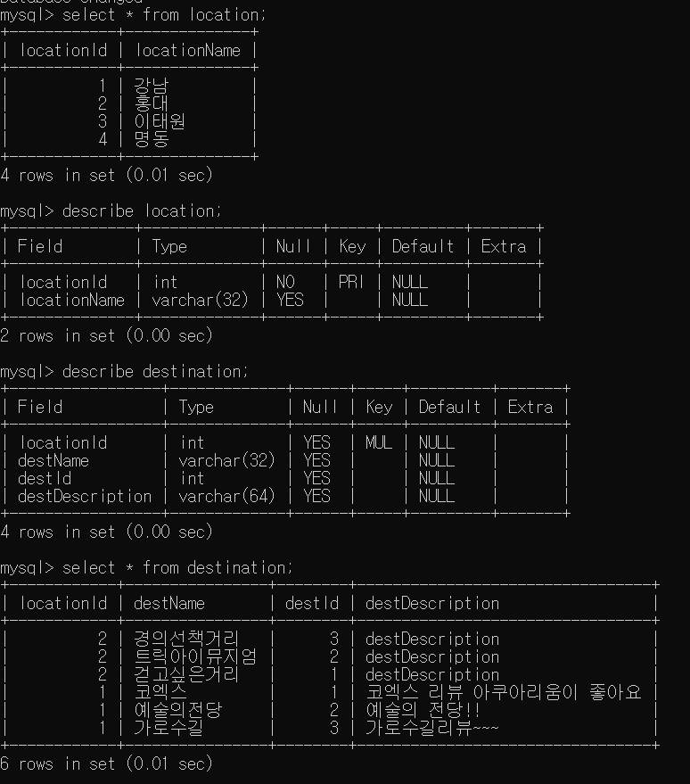
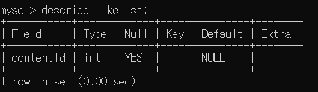

# Introduction

- 서울 관광 지도 및 리뷰 작성 제공하는 웹 사이트.

# Installation

```
git clone https://github.com/lkm2835/Web_Programming.git

```

# Making DB & Table

- MYSQL DB 생성 후 .env에 개인 정보 입력
- review 위해 아래와 같은 테이블 생성 
<p align="center">
  
</p>
(*destination의 description은 null로 넣은 후 사용자가 리뷰 작성 시 put으로 업데이트)

- like 위해 아래와 같은 테이블 생성 
<p align="center">
  
</p>

# START

```
cd Web_Programming
npm start
```


# API
 
         
■ Review 관련 API

1. /admin/review/list

- GET : 작성한 모든 review를 확인할 수 있다.

- location과 destination join을 통해 select

2. /admin/review

- POST : review 작성시 destination 테이블에 저장

- PUT : review 작성 내용 업데이트 (*현재 웹사이트에서 리뷰 작성시 이 방법으로 저장 되고 있음)

■ Like 관련 API

1. /admin/like/list 

- POST : like 한 모든 관광지 및 문화행사 리스트  읽기 가능

- 문화행사 및 관광지 개별 페이지에서 좋아요 상태 확인 가능

- 마이페이지에서 좋아요 한 리스트 확인 가능 
   

2. /admin/like  

- POST : like 버튼 누르면 좋아요 상태 생성

- DELETE : 좋아요 상태에서 다시 like 버튼 누르면 좋아요 취소 


